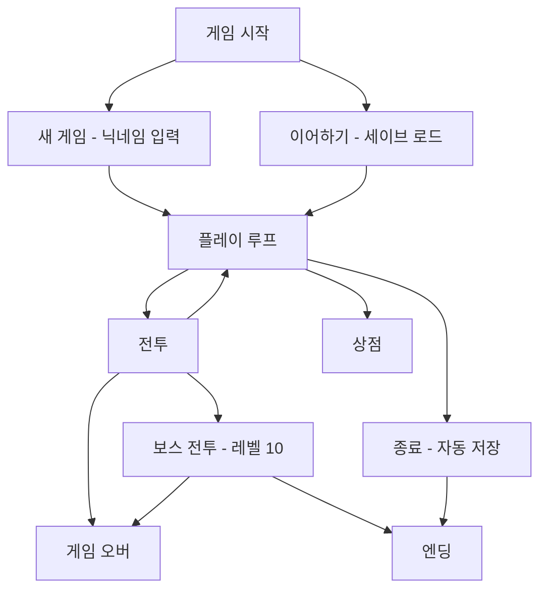
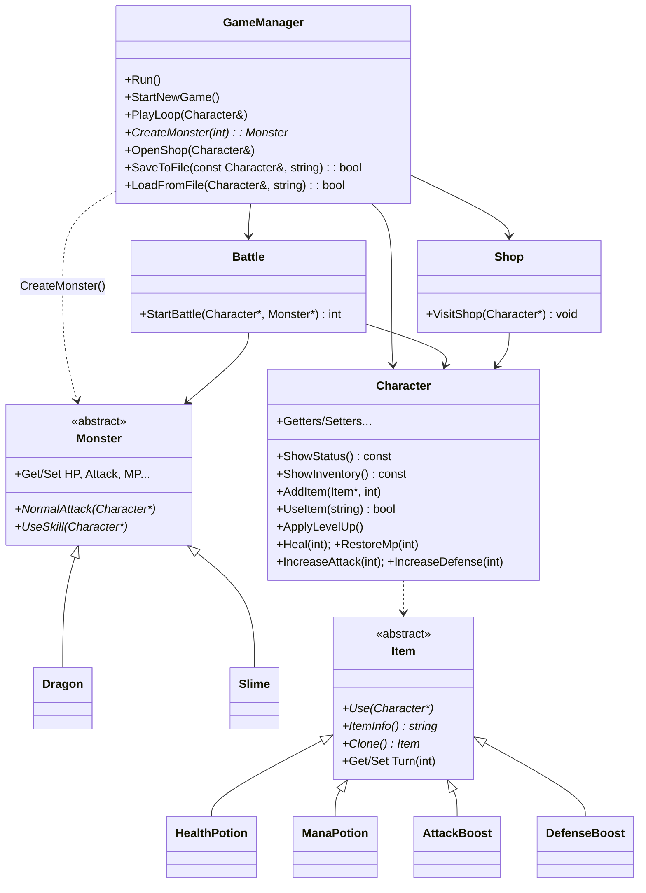

# TeamSix Text RPG

> C++ 학습 및 팀 협업 과제 — 콘솔 기반 텍스트 RPG

 

---

## 📖 프로젝트 개요
- **목적**: C++ OOP, 다형성, 설계 패턴(SOLID/Factory Method), 파일 입출력, 콘솔 UI/사운드 실습
- **기간**: 2025-09-03 ~ 2025-09-11
- **환경**: Windows 10/11, C++17, Visual Studio 2022, WinMM(사운드)  
- **핵심 특징**: 플레이어 성장(레벨업), 전투(공격/스킬/아이템/도주), 보스(드래곤), 상점(구매/판매), 세이브/로드 기능

---

## 🕹️ 게임 플레이 개요
- **시작**: 새 게임(닉네임 입력/규칙 안내) 또는 이어하기(세이브 로드)
- **플레이 루프**: 전투 / (전투 1회 후) 상점 / 종료(자동 저장)
- **전투 규칙**  
  - 플레이어: 공격 / 스킬(더블 어택, MP 20) / 아이템 / 도주  
  - 몬스터: 일반 공격 or 스킬(내부 MP가 3이 되면 스킬)  
  - 결과: 승리(Exp +50, Gold 10~20, 30% 드랍) / 패배(Game Over) / 도주(전투 종료)
- **보스**: 레벨 10 이상 진입 시 **드래곤** 등장 → 승리 시 엔딩(The End)  
- **상점**: 전투 1회 이상 후 이용 가능(구매/판매, 판매가는 50%)

---

## 🧩 아키텍처(요약)
- **GameManager**: 전체 플로우(메뉴, 세이브/로드, 전투·상점 호출), 팩토리(`CreateMonster`, `CreateItemByName`)
- **Character**: 스탯/레벨업/인벤토리
- **Monster(추상)** → `Dragon`, `Slime`, … (다형성)
- **Item(추상)** → `HealthPotion`, `ManaPotion`, `AttackBoost`, `DefenseBoost` (다형성)
- **Battle**: 전투 루프(행동 선택, 몬스터 턴, 아이템 사용용)
- **Shop**: 구매/판매, UI 출력
- **UI/보조**: `DirectionManager`(키 입력), `Color`(콘솔 색상), `Title`/`MonsterArt`(ASCII 아트)

---

## 🗺️ 흐름도

### 전체 흐름

---

## 🚀 실행 방법 (Windows)

1. **프로젝트 열기**  
   - Visual Studio 2022로 `TeamSixFirstProject.sln` 열기  

2. **빌드 설정**  
   - 플랫폼: `x64`  
   - 구성: `Debug` 또는 `Release`   

3. **실행**  
   - Visual Studio에서 `Ctrl + F5` (디버그 없이 실행)  

> ⚠️ 사운드/컬러/키입력은 **Windows API(WinMM/콘솔)** 의존  
> 다른 OS 포팅 시 별도의 대체 모듈 필요

---

## 🎛️ 조작

- **방향키 (↑/↓)** : 메뉴 탐색, 인벤토리 탐색  
- **Enter** : 선택  
- **ESC** : 뒤로/취소  

---

## 🧪 테스트 체크리스트

- [ ] 닉네임 입력 검증 (공백/빈값 불가)  
- [ ] 전투 승리 시 **EXP +50**, **Gold 10~20** 지급  
- [ ] **레벨 10 도달 → 드래곤 보스 전투 → 승리 시 엔딩**  
- [ ] 포션: HP/MP 최대치 초과 없이 회복  
- [ ] 버프: 공격/방어 동일 버프 중복 사용 방지  
- [ ] 상점: 구매/판매, 재고·골드 증감, 4종 아이템 상시 노출  
- [ ] 세이브/로드: `std::quoted` 기반 직렬화/역직렬화 정상 동작  

---

## 🔧 개발 프로세스

- **기획**: 텍스트 RPG 기능 정의 (전투 · 상점 · 세이브/로드 · 보스)  
- **설계**: OOP(추상 클래스/상속/다형성), Factory Method, SOLID 원칙  
- **구현**: C++17/STL, 콘솔 UI, 사운드, 파일 저장/불러오기  
- **테스트**: 체크리스트 기반 검증, 시나리오 플레이  

---

## 👥 팀 & 기여

- Game Manager, 전투, 몬스터, 아이템, 상점 등 역할 분담  
- GitHub Flow 브랜치 전략 권장:  
  - `main`  
  - `DEV`  
  - `feature/*`  
  - Pull Request 리뷰
